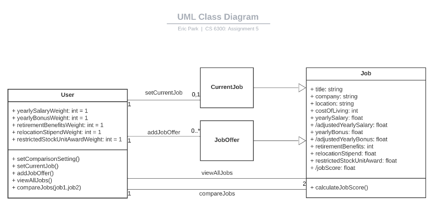
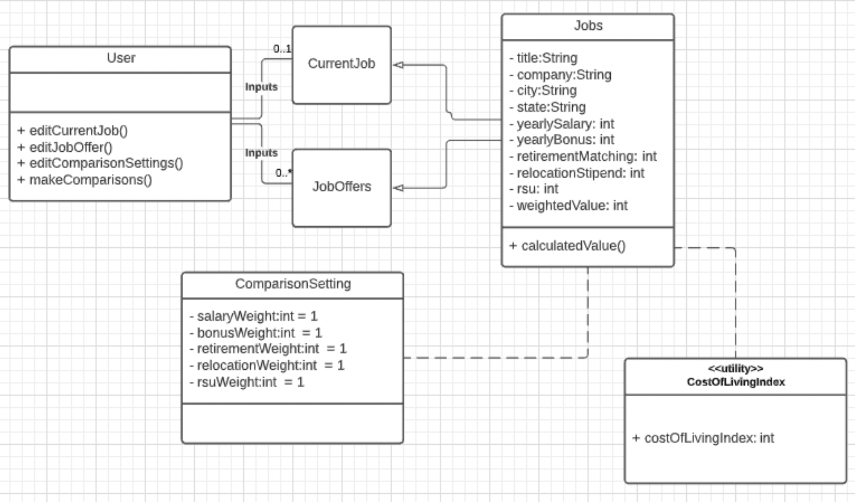
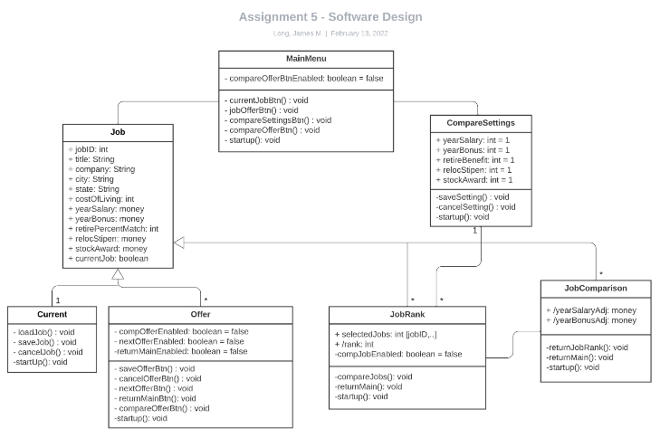
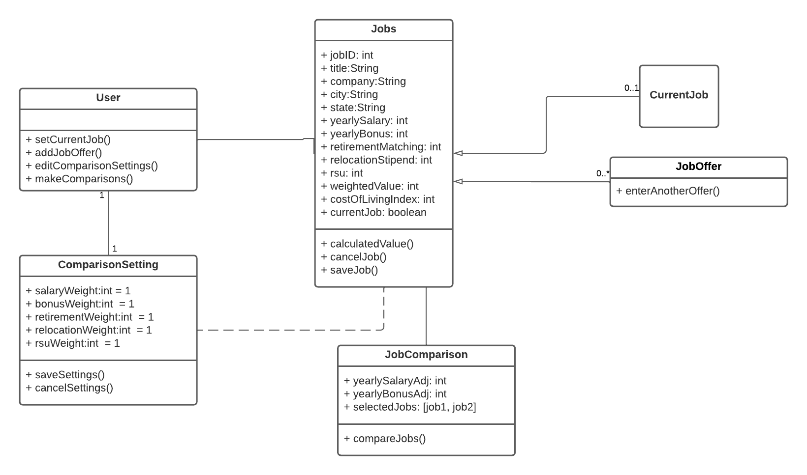

# Design Discussion - Team 102

## Design 1 (epark313)

### Pros:
* Minimalistic design trims down the number of classes, so the design is simple and easy to understand. 
* Design includes an "entry-point" User class that connects the rest of the design, similar to design #2 and the MainMenu class found in design #3.
* Each relationship is associated with a specific function, which covers some of the details missing in the division of classes. 
* The design has the correct one-to-one relationship for the CurrentJob and one-to-many for the JobOffer class.  It also includes a one-to-two relationship for comparing the 2 selected jobs.
* The design includes the default values for the attributes assigned to the Comparison Settings.

### Cons:
* The design incorporates the comparison setting attributes inside the User class, instead of separating them into their own class.
* The design also includes derived values: adjustedYearlySalary and adjustedYearlyBonus as part of the Job super-class, instead of separating into a comparison sub-class.

***

## Design 2 (jbaldera3)

### Pros:
* The design includes the "entry-point" User class, similar to the other designs.
* The design correctly displays the single CurrentJob relationship and multiple JobOffers relationship.
* The design separates the comparison settings into its own ComparisonSetting class with the correctly defined default values of 1. 

### Cons:
* There is no clearly indication of the comparison functionality and design is missing the link between the User and Setting. Missing the requirement of how the user makes the comparison or how the user sets the setting. 
* Missing derived values: adjustedYearlySalary and adjustedYearlyBonus which are calculated based on the user entered cost of living.
* Design separates costOfLivingIndex into a utility, which won't be needed if entered by user. 
* Design is missing the compare only 2 jobs relationship as seen in Design #1.
* Attributes listed for the ComparisonSetting and Jobs classes are marked as private (-) and may need to be public (+) to be consumed by the other classes correctly.

***

## Design 3 (jlong325)

### Pros:
* Design is simple, but covers many details as well. For each class, it covers the functionality of start up, save, cancel, and return to menu.
* Design includes the similiar MainMenu "entry-point" that connects the other classes as seen in the other designs.
* The use of a primary key in the Job class (jobID) is very efficient on how the jobs can be selected for edits or comparison. 
* The use of selectedJobs attribute in the JobRank class clearly portrays which two jobs are being compared.
* Design includes a separate CompareSettings class with default values set to 1 and one-to-many relationship for JobRank.
* Derived attributes of yearSalaryAdj and yearBonusAdj included as part of a JobComparison class.

### Cons:
* There are many relationships among the Setting, JobRank, JobComparison, and Job classes which are difficult to understand.
* The design may be over-engineered with boolean attributes given to represent whether GUI buttons are enabled or disabled.
* The design doesn't include the compare only 2 jobs relationship as seen in Design #1.

***

## Team Design

### Commonalities & Differences:
* The creation of the "entry-point" User / MainMenu class which ties the rest of the classes together was seen in all 3 designs. All 3 designs created an inheritance of attributes from the Job super-class into 2 separate sub-classes: CurrentJob and JobOffer, with a similiar one-to-one or one-to-many relationship defined.  All 3 designs incorporated the comparison settings with default values set to 1.
* The three designs had several differences.  In designs 2 & 3, the comparison settings were created in their own class, where design 1 had the settings as attributes for the User class. Design 2 had the comparison settings linked back to the Jobs super-class and no link to the User class, which design 3 had it linked to the MainMenu and JobRanks class. 
* Design 3 had a separate JobComparison class as well as a JobRank class, inheriting from the Job super-class and CompareSettings class. The other two designs had no separate JobComparison class.
* In our final design we decided to separate the JobComparison into a separate class because it has a specific functionality of dealing with only two selected jobs. This design helps understand the use of the JobComparison class and how it relates to the other classes. This design is similar to Design 3, where some adjustments were made to simplify the complexity of the design on how the class is involved with other classes.
* The attribute costOfIndex is set as an attribute under the Job class, as seen in Design 1 & 3. Our team made this decision to safely assume that the user will provide this value. This is subject to change as a utilty class just like in Design 2 if requirements suggest that the value of this attribute should be derived from the input of the location.

## Summary
We learned a lot from discussing each individual design on how the same requirement can be designed in many different ways. In the initial phase of our meeting, each member went over the details of his design which helped understand better on why a specific decision was made. Given the reason, we were able to justify as a team if that reason was strong enough to be included in our final team design.
We also learned that because of the difficulties on our designs, we were able to balance on how detailed or generic our design should be. This shows that when different minds are put together, we can pick out the best from each member and accomodate the cons by bringing in the pros from another member.
Although our meeting went flawlessly, there were some difficulties in conducting the meeting. Video calls were limited by time, so we had to hop on a separate call when our time was up. Also, since we were meeting online, only one member had to be in charge of creating the final design of the diagram. If we were to meet in the same physical location, we could have collaborated in a much more efficient way by drawing prototypes over the white board and making changes as we discussed.
