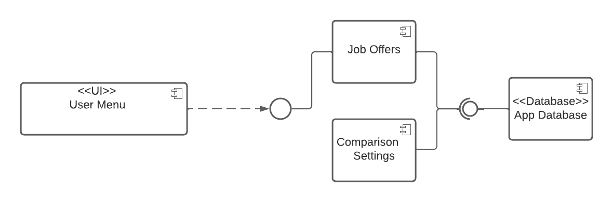
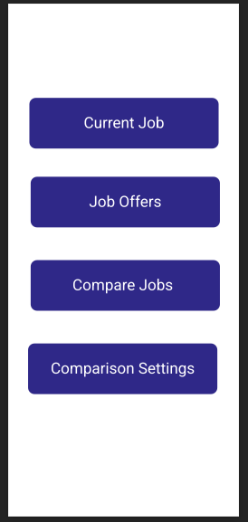
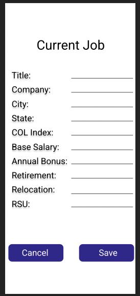
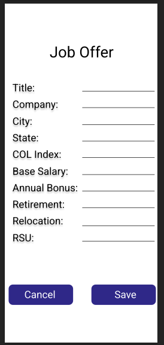
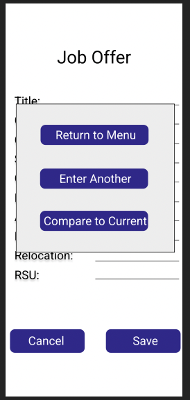
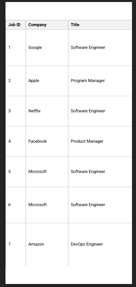
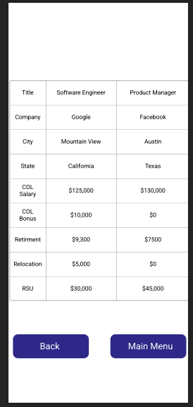
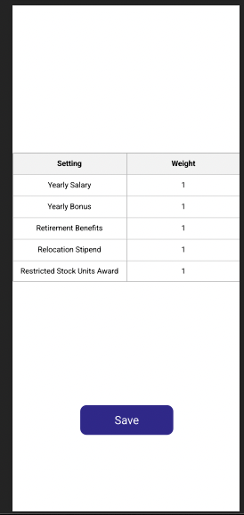

# Design Document

**Author**: Team 102

## 1 Design Considerations

### 1.1 Assumptions

The application satisfies users needs to compare job offers and/or their current job offer to job offers to make a better educated choice when deciding between taking on a new job.  For the application, the local storage of the device will be used to store job offers the user has saved previously.  The application will only need to run on Andorid devices that support API 29 and above.

### 1.2 Constraints

The application is being developed for a short-term academic project, therefore, functionality and ease of use is valued over an immersive user experience.

### 1.3 System Environment

The software will be running on an Android Device.  The software will have support for API 29 and above on the Android SDK.  Not much data will be stored in the application, thereform SQLite will suffice as a database in this case.

## 2 Architectural Design

### 2.1 Component Diagram

The User Interface will provide a way to interact and input job offers.  Once job offers are inputted into the system, they will be stored in the database.  The weight settings will also be stored in the database.

### 2.2 Deployment Diagram

A deployment diagram is not necessary in this system becasue all of the components will exist on the device on which the app is running.  There will be no need for the device to communicate externally with any other outside system.

## 3 Low-Level Design

### 3.1 Class Diagram

## 4 User Interface Design

