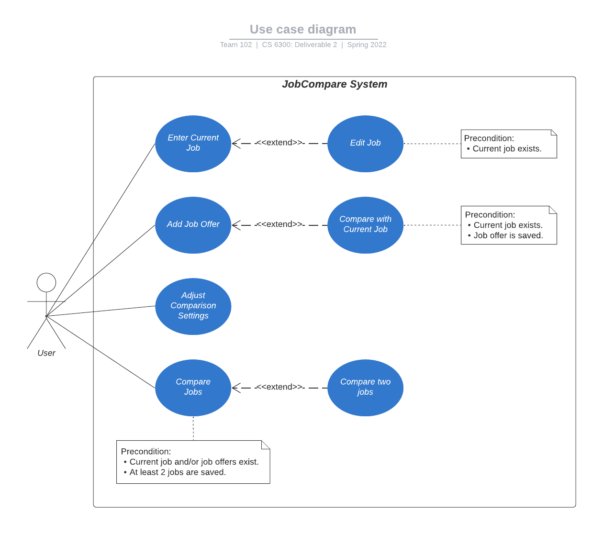

# Use Case Model

**Author**: Team 102

*Version 2: Revised the use case diagram. Separated the use case of entering and editing current job.*

## 1 Use Case Diagram

## 2 Use Case Descriptions

### Use Case 1: Enter/Edit Current Job

#### Requirements
* Allows the user to enter a current job if it hasn't been previously entered. Otherwise, the user is allowed to edit the current job with the updated values.

#### Pre-conditions
* The user must select the Set Current Job button from the Main Menu.

#### Post-conditions
* If user selects to set the current job option after previously saving a current job, the values of the saved current job will be displayed.  If there is not a current job in the database, all fields will be left blank.
* The current job is listed in the table that contains all the jobs if current job exists.
* User is able to compare an added job offer to the current job after adding and saving a job offer if current job exists.

#### Scenarios
*Normal: User enters current job for the first time*
* User selects the option to set the current job.
* User inputs the value for all the required fields.
* User selects to save the current job.
* User is returned to the main menu.

*Normal: User edits current job*
* User selects the option to set the current job.
* User is shown the form with the original values filled.
* User updates the values as necessary.
* User selects to save the current job.
* Current job attributes are overwritten with the updated values.
* User is returned to the main menu.

*Alternative: User cancels setting current job*
* User selects the option to set the current job.
* User selects to cancel.
* If first time, no current job is saved.
* If current job was already saved, the values are not updated.
* User is returned to the main menu.

### Use Case 2: Add Job Offer

#### Requirements
* Allows user to add a job offer.

#### Pre-conditions
* The user must select the option to add job offer.

#### Post-conditions
* The job offer is listed in the table that contains all the jobs if job offer is saved.

#### Scenarios
*Normal: User adds job offer*
* User selects the option to add job offer.
* User inputs the value for all the required fields.
* User saves the job offer.
* User is shown options to perform other actions (compare to current job, enter another job offer, return to main menu).

*Normal: User adds another job offer after saving a job offer*
* User selects the option to enter another job offer after saving a job offer.
* User is shown a new form to add job offer.
* * User inputs the value for all the required fields.
* User saves the job offer.
* User is shown options to perform other actions again. 

*Alternative: User cancels adding job offer*
* User selects the option to add job offer.
* User selects to cancel.
* Job offer will not be saved.
* User is returned to the main menu.

### Use Case 3: Compare with Current Job

#### Requirements
* Allows the user to compare the newly added and saved job offer to the current job.

#### Pre-conditions
* Current job must be set and saved.
* Job offer must be added and saved.
* The user must select the option to compare the new saved job offer to the current job.

#### Post-conditions
* User is shown a table that compares the new saved job offer with the current job.

#### Scenarios
*Normal: User compares the new job offer to the current job*
* User adds and saves a new job offer.
* User selects option to compare the new job offer to the current job.
* User is shown a table that compares the new saved job offer with the current job.
* User has the option to perform other actions (enter another job offer, return to main menu).

### Use Case 4: Adjust Comparison Settings

#### Requirements
* Allows user to adjust comparison settings that applies to the comparison of two jobs.

#### Pre-conditions
* The user must select the option to adjust the comparison settings.

#### Post-conditions
* If multiple job offers exist, the order of the jobs in the table, where it contains all jobs, must be arranged based on the job score which is calculated using the weight values that were set in the comparison settings.

#### Scenarios
*Normal: User adjusts the values in comparison settings*
* User selects the option to adjust comparison settings.
* User inputs the weights for each field based on the ratings from 1-5.
* User saves the settings.
* User is returned to the main menu.

*Alternative: User cancels adjusting comparison settings*
* User selects the option to adjust comparison settings.
* User selects to cancel.
* If settings was previously adjusted, the weights are returned to their original value.
* If settings was never adjusted, no changes are made to the settings and the default value will be used.

### Use Case 5: Compare Jobs

#### Requirements
* Allows user to view all jobs to make selection of jobs to compare.

#### Pre-conditions
* The user selects the option to view all jobs.

#### Post-conditions
* The user is shown a table which contains all jobs ranked in best to worse based on the job score.
* If no jobs were saved, the table will be empty.

#### Scenarios
*Normal: User views all jobs*
* User selects the option to view all jobs.
* User is shown a table with all the jobs ranked in best to worse based on the job score.
* If no jobs were saved, the table will be empty.
* User has the option to perform other actions (compare two jobs, return to main menu).

### Use Case 6: Compare two jobs

#### Requirements
* Allows user to select and compare two jobs from the table that contains all jobs.

#### Pre-conditions
* At least two job offers are saved, if current job doesn't exist.
* At least one job offer is saved, if current job exists.
* The user must select the option to view all jobs.
* The user must select the option to compare the jobs after selecting two jobs in the table.

#### Post-conditions
* The user is shown a comparison table which contains all the values for the selected jobs next to each other.

#### Scenarios
*Normal: User compares two jobs*
* User selects the option to view all jobs.
* User selects two jobs in the table.
* User selects the option to compare the jobs.
* User is shown the comparison table.
* User has the option to do another comparison or return to main menu.
