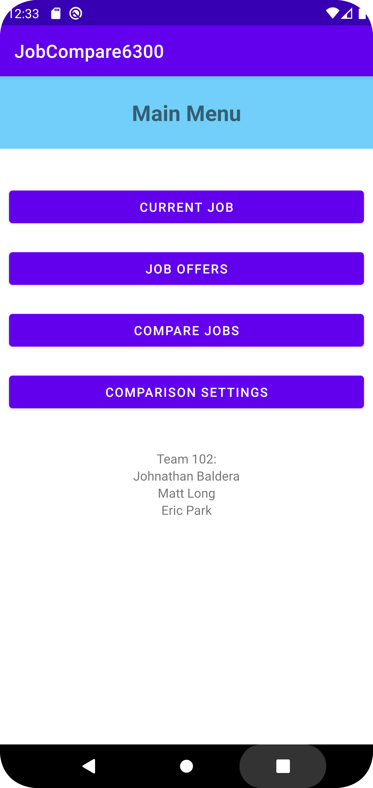
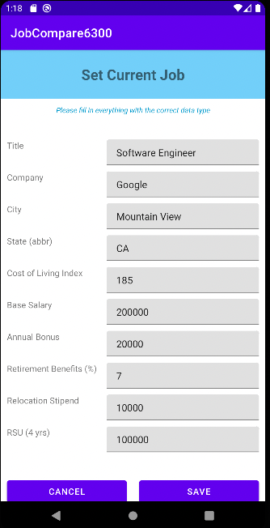
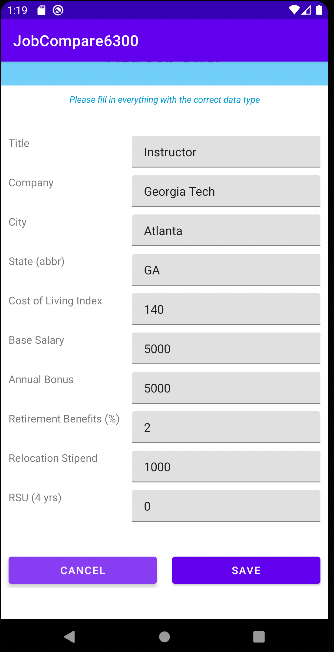
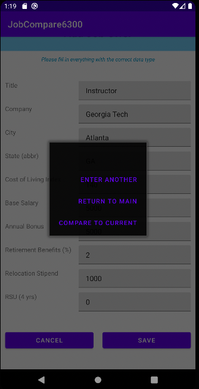
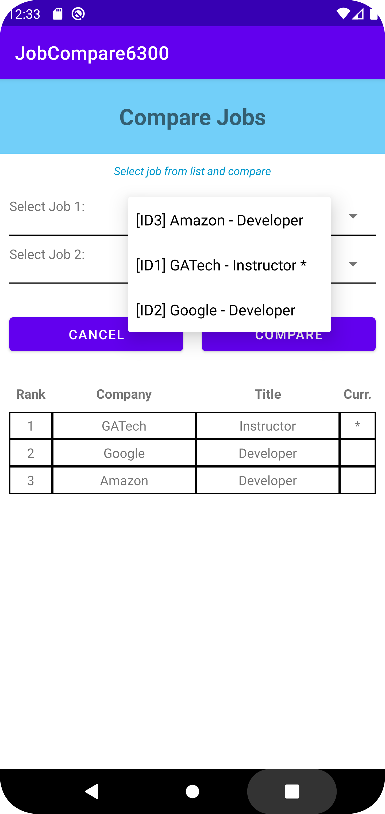
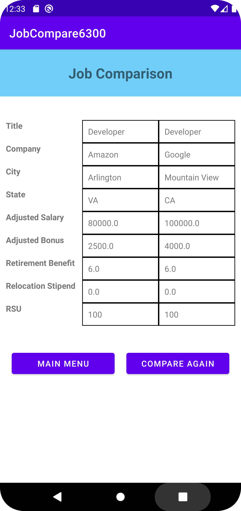
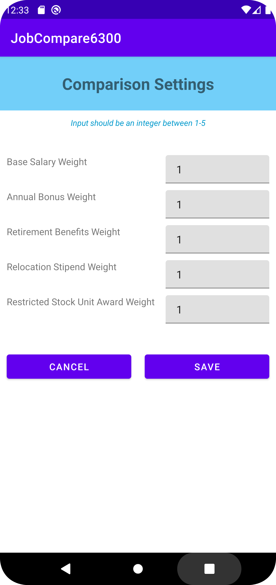

# User Manual

**Author**: Team 102

<br/>

## Table of contents
- [Introduction](#Introduction)  
- [Main Menu](#MainMenu)  
- [Current Job](#CurrentJob)  
- [Job Offers](#JobOffers)
- [Compare Jobs](#CompareJobs)
- [Comparison Settings](#ComparisonSettings)  

<br/>

### Introduction <a name="Introduction"></a>

This is a single-user mobile application that was built to enable a user to compare their current job details with multiple job offers. The application provides a comparison setting for users to add emphasis on what about their job offer is most important to them. The application will return a ranked list (based on comparison setting weights and other metrics) of job offers and the current job. This will enable the user to make an informed decision about potentially changing jobs.
<br/>

### Main Menu <a name="MainMenu"></a>
*Main page that includes all functions of the app*



#### Steps
1. Start the app by clicking on the icon for the application from your Android device.
2. Main Menu appears with 4 buttons as shown above.
3. Click on any (enabled) button to perform your action.

#### Additional Information
* COMPARE JOBS button will be disabled if there are less than 2 jobs saved.
* Disabled button will be shown as a faded button that is unclickable.
* To enable the COMPARE JOBS button, you need to save either at least 1 current job + 1 job offer OR 2 job offers.

<br/>

### Current Job <a name="CurrentJob"></a>
*Page to add or edit current job*



#### Steps

1. Add appropriate data to the following fields:
    * Title (String)
    * Company (String)
    * City (String)
    * State (String)
    * Cost of Living Index (Float)
    * Base Salary (Float)
    * Annual Bonus (Float)
    * Retirement Benefits (Float)
    * Relocation Stipend (Integer)
    * RSU (Integer)
2. Click the Save button to store your current job information.

#### Additional Information
* Clicking the cancel button will allow you to exit without saving, returning you to the main menu.

<br/>

### Job Offers <a name="JobOffers"></a>
*Page to add job offer*

&nbsp;&nbsp;&nbsp;&nbsp;

#### Steps
1. Add appropriate data to the following fields:
    * Title (String)
    * Company (String)
    * City (String)
    * State (String)
    * Cost of Living Index (Float)
    * Base Salary (Float)
    * Annual Bonus (Float)
    * Retirement Benefits (Float)
    * Relocation Stipend (Integer)
    * RSU (Integer)
2. Click the Save Button to store the entered job offer.
3. When saving the Job Offer, a dialog with the following 3 buttons will pop-up:

		1. "Enter Another" - Allows the user to enter an additional job offer.
		2. "Return To Main" - Returns user to main menu.
		3. "Compare To Current" - Clicking this will compare the just entered job offer to the current job.


#### Additional Information
* Clicking the cancel button will allow you to exit wtihout saving, returning you to the main menu.
* **Compare to Current** button will only be visible if there is a current job found in the database.


<br/>

### Compare Jobs <a name="CompareJobs"></a>
*Page to view the rank of all jobs and compare 2 jobs*

&nbsp;&nbsp;&nbsp;&nbsp;

#### Steps

1. Once the COMPARE JOBS button is enabled in the Main Menu, click on the button.
2. Compare Jobs page will be shown with two drop down menus and a table that contains all jobs.
3. Select a job from both drop down menus to compare.
4. Click on the CANCEL button to be directed back to the Main Menu.
5. Click on the COMPARE button to be directed to another page that displays a table with the comparison.
6. After selecting two jobs and clicking the COMPARE button, a table will be shown with both jobs side by side.
7. Click on MAIN MENU button to be directed to the Main Menu.
8. Click on COMPARE AGAIN button to be directed to the Compare Jobs page to do another comparison.

#### Additional Information
* COMPARE JOBS button will be disabled in the Main Menu if there are less than 2 jobs saved.
* Disabled button in the Main Menu will be shown as a faded button that is unclickable.
* To enable the COMPARE JOBS button, you need to save either at least 1 current job + 1 job offer OR 2 job offers.
* The drop down menu has a list of all jobs in alphabetical order (company then title), following the format '[ID#] Company - Title'.
* Current job will be displayed in the drown down menu or the table with a * at the end.
* The table in the Compare Jobs page shows all the jobs ranked by the job score.
* Job score is calculated by the formula below:

```
Job Score = ((SAW/TOW)*AYS) + ((BOW/TOW)*AYB) + ((RTW/TOW)*YS*RT/100) + ((RLW/TOW)*RL) + ((STW/TOW)*RSU/4)

where:
SAW = Salary Weight Input (1-5)
BOW = Bonus Weight Input (1-5)
RTW = Retirement Benefits Weight Input (1-5)
RLW = Relocation Stipend Weight Input (1-5)
STW = Restricted Stock Unit Award Weight Input (1-5)
TOW = Total Weight (SAW+BOW+RTW+RLW+STW)

AYS = Yearly Salary Adjusted for Cost of Living (YS*100/COL)
AYB = Yearly Bonus Adjusted for Cost of Living (YB*100/COL)
COL = Cost of Living Index
YS = Yearly Salary
YB = Yearly Bonus

RT = Retirement Benefits
RL = Relocation Stipend
RSU = Restricted Stock Unit Award (expressed as a lump sum vested over 4 years)
```

<br/>

### Comparison Settings <a name="ComparisonSettings"></a>
*Page to adjust comparison settings*



#### Steps
1. In the Main Menu, click on COMPARISON SETTINGS button to adjust your settings.
2. Comparison Settings page appears with 5 text boxes (Weight for salary, bonus, retirement benefits, relocation stipend, and RSU).
3. All the text boxes have a 1 as a default. Change the value as necessary.
4. For each text box, input a number between 1-5 to adjust the weight for each category.
5. Click on the CANCEL button to be directed back to the Main Menu.
6. After updating the weights, click on the SAVE button to save your settings.
7. When saved, you will be directed back to the Main Menu and a confirmation message will be shown at the bottom of the screen.

#### Additional Information
* When you return to the Comparison Settings page after saving the updated weights, you will be shown the new weights in the text boxes.
* All text boxes in the Comparison Settings page only accept a single number as an input.
* If you click on the SAVE button with empty text boxes, an alert will be displayed on each text box that is empty.
* If you click on the SAVE button with inputs not in the range of 1-5, an alert will be displayed on each text box with the problem.
* For any invalid attempt to save the settings, an error message will be shown at the bottom of the screen.
